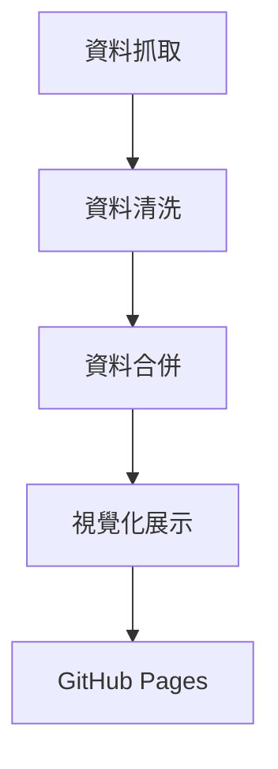

# 📈 股票自動化分析平台

本專案為 DevOps 課程的期末專案，旨在建構一個自動化的股票資料分析平台。整合資料抓取、清洗、視覺化與部署流程，實現從資料取得到展示的全流程自動化。

🔗 [GitHub Pages Demo](https://byteeat8bits.github.io/DevOps-Final-Project/)

---

## 🧰 專案功能

- **資料抓取**：使用 `fetch_data.py` 從公開 API 取得股票資料。
- **資料清洗**：透過 `data_clean.py` 處理缺失值與格式統一。
- **資料合併**：利用 `merge_data.py` 整合多來源資料。
- **視覺化展示**：將處理後的資料以圖表方式呈現在網頁上。
- **自動化流程**：結合 GitHub Actions 實現 CI/CD，自動部署至 GitHub Pages。

---

## 🧱 系統架構

## 🔄 自動化部署

- 使用 GitHub Actions 監控主分支的變更，自動執行資料處理腳本並部署至 GitHub Pages。
- 每次推送更新後，網站將自動更新展示最新的分析結果。

## 👥 貢獻者

- @EvanLo62
- @LCY000
- @Weixun93

## 📷 專案畫面

## 目前此專案已暫停維運
